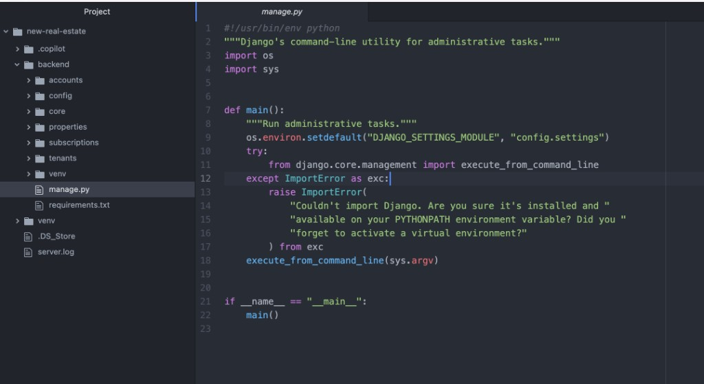

# The Mango Theme

[](https://marketplace.visualstudio.com/items?itemName=sanjeevkse.the-mango-theme)


A dark theme built for **readable, comfortable coding** — calm syntax colors, subtle line highlights, and a clean sidebar. One JSON file, easy to customize.

When you select **Mango Dark**, the extension applies editor defaults that match this layout: no minimap, hidden activity bar, generous line height, and indentation guides — the same friendly spacing you remember from classic GitHub-era editors.

## Screenshots



## Installing

[Visual Studio Code Marketplace](https://marketplace.visualstudio.com/items?itemName=sanjeevkse.the-mango-theme)

**Local test:** open this folder → **F5** → **Preferences: Color Theme** → **Mango Dark**.

## Recommended settings

These apply when you select **Mango Dark**. If something still looks off, your user settings may be overriding them — open Settings and search for `editor.fontFamily` / `editor.fontSize`.

```json
{
  "editor.fontFamily": "Menlo, Consolas, 'DejaVu Sans Mono', monospace",
  "editor.fontSize": 14,
  "editor.lineHeight": 1.5,
  "editor.semanticHighlighting.enabled": false,
  "editor.minimap.enabled": false,
  "explorer.openEditors.visible": 0,
  "workbench.activityBar.location": "hidden"
}
```

After switching theme: **Cmd+Shift+P → Developer: Reload Window**.

## Contributing

See **[THEMES.md](./THEMES.md)** for how the theme file is structured.

## What's new?

[Changelog](./CHANGELOG.md)

## Sponsors

[Sponsor](https://github.com/sponsors/sanjeevkse) this project on GitHub.
